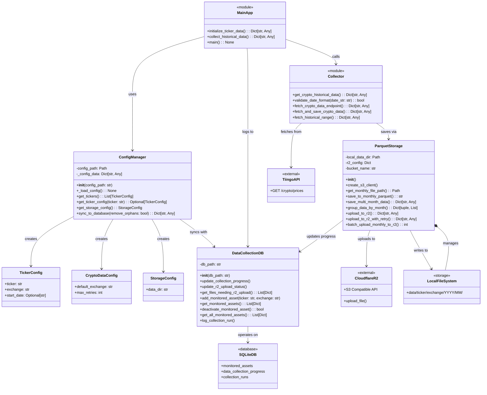
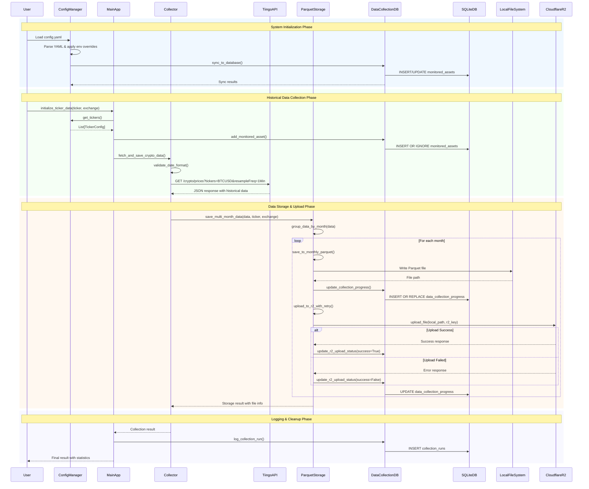
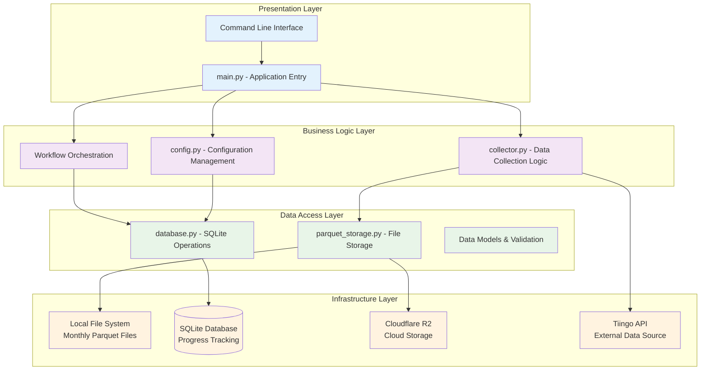
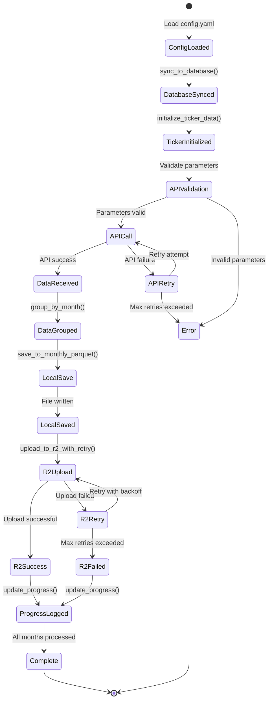

# AGENTS.md

This file provides guidelines for agentic coding agents operating in this repository.

## Commands

- **Run all tests**: `pytest`
- **Run a specific test file**: `pytest tests/test_api.py`
- **Run a single test**: `pytest tests/test_api.py::TestGetCryptoHistoricalData::test_successful_api_call_specific_date`
- **Linting**: `ruff check .`
- **Formatting**: `ruff format .`

## Code Style

- **Simplicity First**: Simplify the code style, never over engineer the code, only add complexity when there is a need.
- **Imports**: Group imports into three sections: standard library, third-party packages, and application-specific modules, separated by a blank line.
- **Formatting**: Adhere to `ruff` formatting.
- **Types**: Use type hints for function arguments and return values.
- **Naming Conventions**: Use `snake_case` for functions and variables, and `PascalCase` for classes.
- **Error Handling**: Use `try...except` blocks for operations that can fail, such as network requests or file I/O. Raise `ValueError` for invalid function arguments.
- **Docstrings**: Use docstrings for all public modules, classes, and functions.
- **Testing**: Use `pytest` for tests. Use classes to group related tests.

## Test Suite Overview

The test suite provides comprehensive coverage for the crypto market data aggregator, ensuring reliability across API
interactions, data storage, validation, and cloud upload functionality.

### Test Configuration (`tests/conftest.py`)

**Purpose**: Central pytest configuration with shared fixtures and mocking

- `mock_external_services`: Auto-mock for all external services (boto3, database)
- `temp_data_dir`: Temporary directory for file operations
- `mock_env_vars`: Mock environment variables for testing
- `cleanup_test_directories`: Session-level cleanup of test artifacts
- `sample_api_response`: Standard Tiingo API response for testing
- `empty_api_response` / `error_api_response`: Edge case API responses

### API Testing (`tests/test_api.py`)

**Purpose**: Test Tiingo API integration and data fetching functionality

#### TestGetCryptoHistoricalData

- `test_missing_tiingo_token`: Validates error when API token missing
- `test_successful_api_call_*`: Various successful API call scenarios
- `test_api_error_*`: HTTP error handling (404, 500, network issues)
- `test_empty_response`: Handle empty API responses

#### TestFetchCryptoDataEndpoint

- `test_successful_fetch_with_validation`: Complete fetch with validation
- `test_validation_error_prevents_api_call`: Input validation blocking API calls

#### TestFetchAndSaveCryptoData

- `test_successful_fetch_and_save`: End-to-end fetch + save operation
- `test_api_error_prevents_save`: Error handling in save pipeline
- `test_save_error_handling`: Storage failure scenarios
- `test_date_determination_logic`: Date parameter precedence logic

### Data Validation Testing (`tests/test_date_validation.py`)

**Purpose**: Validate date formats and input parameters

#### TestValidateDateFormat

- `test_valid_date_formats`: Accept YYYY-MM-DD formats including leap years
- `test_invalid_date_formats`: Reject malformed dates, wrong formats
- `test_edge_cases`: Whitespace, extra characters, special cases

#### TestFetchCryptoDataEndpointValidation

- `test_missing_ticker`: Require ticker symbol
- `test_invalid_date_format_*`: Date format validation for all parameters
- `test_date_range_validation_*`: Start/end date logic validation
- `test_specific_date_overrides_range`: Parameter precedence testing

### Monthly Parquet Storage Testing (`tests/test_monthly_parquet_storage.py`)

**Purpose**: Test monthly file storage system and data operations

#### TestMonthlyParquetStorage (Main class with 25+ tests)

- **File Path Management**: `test_get_monthly_file_path`
- **Data Saving**: `test_save_to_monthly_parquet_*` (new files, empty data, missing timestamps)
- **Data Appending**: `test_append_to_monthly_file_*` (existing files, duplicates, deduplication)
- **Data Reading**: `test_read_from_monthly_parquet_*` (success, file not found)
- **Data Grouping**: `test_group_data_by_month_*` (by month, different timestamp formats)
- **Multi-Month Operations**: `test_save_multi_month_data_*` (spanning months, empty data)
- **R2 Integration**: `test_get_monthly_files_for_upload`, upload success/failure scenarios
- **Batch Operations**: `test_batch_upload_*` (success, no files, partial failures)
- **Module Functions**: Test standalone functions like `save_crypto_data_to_parquet`

### R2 Cloud Storage Testing (`tests/test_r2_upload.py`)

**Purpose**: Test Cloudflare R2 upload functionality and cloud storage integration

#### TestR2Upload

- `test_create_s3_client_*`: S3 client creation (success/failure)
- `test_upload_to_r2_*`: Upload operations (success, client failure, upload errors)
- `test_upload_various_client_errors`: Different AWS/R2 error scenarios
- `test_upload_large_file_simulation`: Performance testing simulation

#### TestR2Configuration

- `test_missing_r2_credentials`: Handle missing environment variables
- `test_partial_r2_credentials`: Partial credential scenarios
- `test_r2_client_creation_*`: Client creation with credential issues

#### TestR2Integration

- `test_end_to_end_upload_flow`: Complete save → upload pipeline
- `test_batch_upload_error_handling`: Batch upload failure scenarios
- `test_monthly_upload_function_*`: Monthly upload functionality
- `test_batch_upload_*`: Multi-file upload scenarios

### Key Testing Patterns

1. **Mocking Strategy**: Global auto-mock prevents real external service calls
2. **File Operations**: Temporary directories ensure test isolation
3. **Error Coverage**: Comprehensive error scenario testing
4. **Integration Testing**: End-to-end workflows from API to storage
5. **Edge Case Testing**: Empty data, malformed inputs, missing files
6. **Configuration Testing**: Environment variable handling and defaults

### Test Execution Notes

- All tests use automatic mocking of external services (R2, database)
- Temporary directories ensure no test pollution
- Response mocking eliminates network dependencies
- Environment variable patching provides controlled test conditions
- 72+ total tests providing comprehensive coverage across all components

## Core Workflows

The application follows a layered architecture with distinct phases for data collection, processing, and storage.
Understanding these workflows is essential for development and debugging.

### 1. System Initialization Workflow

```
User Action → Load config.yaml → Sync to Database → Validate Tickers → Ready for Collection
```

**Key Components:**

- `ConfigManager` loads and validates YAML configuration
- `sync_to_database()` ensures monitored_assets table is synchronized
- Tickers not in config are soft-deleted (marked as `is_active = FALSE`)
- Environment variable overrides are applied for deployment flexibility

**Entry Points:**

- `ConfigManager.__init__()`
- `sync_config_to_database()`

### 2. Historical Data Collection Workflow

```
Initialize Ticker → API Validation → Fetch from Tiingo → Group by Month → Save Locally → Upload to R2 → Log Progress
```

**Data Flow:**

- `main.py` orchestrates the collection process
- `collector.py` handles API communication and validation
- `ParquetStorage` manages monthly file creation and deduplication
- `DataCollectionDB` tracks progress and upload status
- Automatic retry logic for failed R2 uploads

**Key Functions:**

- `initialize_ticker_data()` - Complete historical collection
- `fetch_and_save_crypto_data()` - Core collection logic
- `save_multi_month_data()` - Monthly file management

### 3. Soft Delete Management Workflow

```
Remove from config.yaml → Sync to Database → Set is_active=FALSE → Skip in Future Operations
```

**Behavior:**

- Configuration file serves as the single source of truth
- Database records are preserved for historical reference
- `is_active` flag controls operational behavior
- All queries respect active status to maintain data consistency

**Functions:**

- `sync_to_database(remove_orphans=False)` - Safe soft delete
- `get_files_needing_r2_upload()` - Only returns active assets
- `get_monitored_assets()` - Filters by active status

### 4. Batch Upload & Recovery Workflow

```
Scan Database → Filter Active Assets → Check Upload Status → Retry Failed Uploads → Update Status
```

**Process:**

- Database-driven approach ensures consistency
- Age-based filtering for upload prioritization
- Automatic retry logic with exponential backoff
- Status tracking prevents duplicate uploads
- Failed uploads are logged for manual review

**Entry Point:**

- `batch_upload_monthly_to_r2()` - Main batch upload function

### 5. File System Organization

```
data/ticker/exchange/YYYY/MM/ticker_exchange_YYYYMM.parquet
```

**Structure Benefits:**

- Hierarchical organization enables efficient querying
- Monthly sharding prevents large file issues
- Exchange separation supports multi-source data
- Consistent naming convention aids automation
- Direct mapping to R2 cloud storage structure

### Workflow Integration Points

**Configuration ↔ Database:**

- Bidirectional sync maintains consistency
- Config changes trigger database updates
- Soft delete preserves historical data

**Storage ↔ Database:**

- Progress tracking for each monthly file
- Upload status monitoring and retry logic
- Metadata storage for file management

**API ↔ Storage:**

- Multi-month data handling with automatic grouping
- Deduplication and timestamp-based sorting
- Error handling preserves data integrity

These workflows ensure reliable, scalable historical data collection with comprehensive error handling and recovery
mechanisms.

## UML System Diagrams

The following UML diagrams provide visual representations of the system architecture, component relationships, and data
flow patterns.

### Class Diagram - System Architecture



### Sequence Diagram - Complete Data Collection Flow



### Component Diagram - System Architecture Layers



### State Diagram - Data Collection State Management


These UML diagrams provide comprehensive visual documentation of the system architecture, showing class relationships,
data flow, component layering, and state management for effective system understanding and maintenance.

